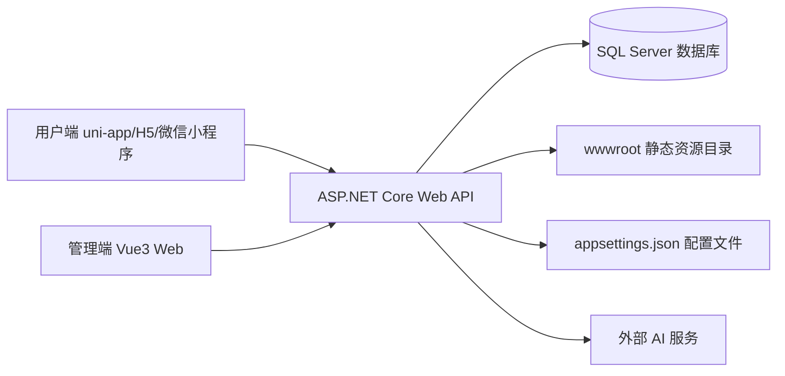
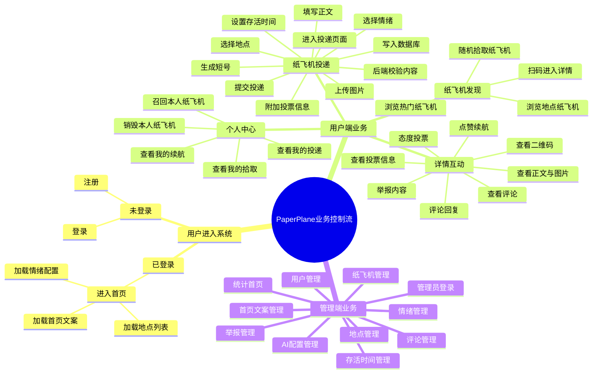
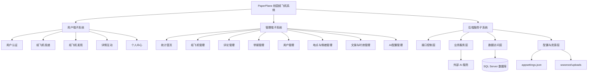
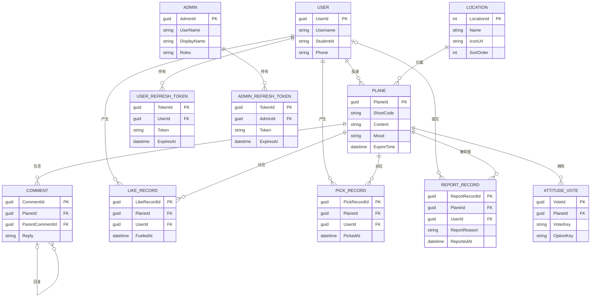

# PaperPlane 校园纸飞机系统概要设计说明书

学院：__________

班级：__________

姓名：__________

学号：__________

## 修订历史记录

| 日期 | 版本 | 说明 | 作者 |
| --- | --- | --- | --- |
| 2026-05-15 | 1.0 | 根据项目现有实现整理概要设计说明书 | Codex |

## 目录

1. 引言
1.1 编写目的
1.2 定义
1.3 项目背景
1.4 参考资料
2. 范围
2.1 系统主要目标
2.2 主要软件需求
2.3 产品需求列表
2.4 运行环境设计
2.4.1 子系统拓朴图
2.4.2 硬件运行环境
2.4.3 软件运行环境
2.4.4 系统余量设计
2.5 设计约束、限制
3. 软件系统结构设计
3.1 业务控制流描述
3.2 软件体系结构
3.2.1 软件程序结构图
3.2.2 模块描述
4. 数据设计
4.1 数据字典复审
4.1.1 PaperPlane 系统 E-R 图
4.2 数据表
5. 接口设计
5.1 用户界面设计规则
5.2 内部接口设计
5.3 外部接口设计
6. 系统性能设计
6.1.1 精度要求
6.1.2 时间特性要求
6.1.3 灵活性
7. 人工处理过程
8. 开发人员角色划分
9. 出错处理设计
9.1.1 补救措施

## 1 引言

### 1.1 编写目的

为了明确 PaperPlane 校园纸飞机系统的软件开发思路、模块划分和实现方式，在完成项目可行性分析、需求分析和技术选型的基础上，对系统总体结构、数据组织、接口关系、运行环境和异常处理策略进行统一说明，特编写本概要设计说明书。本文档用于指导后续的编码实现、联调测试、部署运行以及课程设计材料整理工作。

### 1.2 定义

1. PaperPlane：本项目名称，表示面向校园场景的纸飞机匿名互动系统。
2. 纸飞机：用户在系统中投递的一条内容记录，包含地点、正文、情绪、时效、图片以及可选投票信息。
3. 短号：系统为纸飞机生成的唯一 10 位编码，用于详情访问、二维码生成和扫码识别。
4. 续航：用户对纸飞机点赞后，为该纸飞机增加存活时长的业务行为。
5. 拾取：用户查看纸飞机详情或随机获取纸飞机时产生的读取行为，并累计拾取次数。
6. 召回：投递者主动提前结束本人纸飞机展示状态的业务行为。
7. 销毁：投递者主动将本人纸飞机彻底下线的业务行为。
8. JWT：JSON Web Token，用于用户端与管理端的身份认证和权限控制。
9. SQL Server：本系统采用的关系数据库管理系统。
10. uni-app：本系统用户端采用的跨端前端开发框架。

### 1.3 项目背景

随着校园内部匿名社交、轻表达和地点化互动需求的增加，传统即时聊天或公开发帖方式在“低压力表达”和“现场感互动”方面存在不足。PaperPlane 系统以“纸飞机”为内容载体，将用户表达与校园具体地点结合起来，让用户能够在图书馆、食堂、操场、教学楼等场景下投递内容、拾取内容并进行评论和投票互动，从而形成具有校园特色的弱社交系统。

本项目同时包含用户端、管理端和后端服务。用户端面向普通学生用户，管理端面向系统管理员，后端负责业务处理、数据持久化、资源发布、认证鉴权和 AI 投票建议等能力的统一支撑。

### 1.4 参考资料

1. 项目根目录《概要设计说明书（示例）.docx》
2. 项目根目录《项目简介.md》
3. 项目根目录《需求分析.md》
4. 项目根目录《技术选型.md》
5. `server` 后端工程代码
6. `admin` 管理端工程代码
7. `用户端uniapp版本` 用户端工程代码

## 2 范围

### 2.1 系统主要目标

通过本系统的实施，实现校园纸飞机内容的投递、发现、互动和管理。其中包括对纸飞机内容、评论内容、地点信息、情绪标签、用户资料、举报记录和后台配置项的有效管理，使系统能够在保证匿名性、互动性和可扩展性的基础上，为校园场景提供稳定的轻社交服务。

### 2.2 主要软件需求

本系统主要实现以下软件需求：

1. 普通用户可以在移动端完成注册、登录、资料维护、头像上传和个人历史查询。
2. 普通用户可以围绕校园地点投递纸飞机，并设置情绪、图片、存活时长和附加投票。
3. 普通用户可以浏览地点列表、热门列表、随机纸飞机和纸飞机详情，并完成评论、回复、投票、举报和续航操作。
4. 投递者可以对本人纸飞机进行召回和销毁操作，系统能够区分在线、召回、过期等状态。
5. 管理员可以通过后台系统对地点、情绪、首页文案、存活时长、纸飞机、评论、举报、用户和 AI 配置进行统一管理。
6. 系统需要提供清晰的前后端接口、图片资源上传能力和与外部 AI 服务对接的扩展能力。

### 2.3 产品需求列表

#### （1）用户认证与资料处理需求列表

| 需求编号 | 中文名称 | 需求描述 |
| --- | --- | --- |
| 1 | 用户注册 | 提供注册界面，支持用户名、学号、手机号、密码和图形验证码校验，注册成功后写入用户账号表。 |
| 2 | 用户登录 | 支持手机号或学号登录，登录成功后返回访问令牌和刷新令牌。 |
| 3 | 刷新令牌 | 当访问令牌过期时，系统支持通过刷新令牌获取新的登录态。 |
| 4 | 获取当前用户 | 已登录用户可查询当前登录账户的基本信息。 |
| 5 | 个人资料维护 | 用户可修改用户名、头像、性别和个人简介，修改结果持久化保存。 |
| 6 | 退出登录 | 用户退出登录时，系统应撤销当前或全部有效刷新令牌。 |

#### （2）纸飞机投递处理需求列表

| 需求编号 | 中文名称 | 需求描述 |
| --- | --- | --- |
| 1 | 纸飞机投递处理 | 提供移动端投递界面，支持纸飞机内容录入、图片上传、存活时间选择和投票附加。 |
| 2 | 正文输入 | 支持录入不超过 200 字符的纸飞机正文，保存前进行非空与内容过滤检查。 |
| 3 | 情绪选择 | 用户可从后台预设的情绪列表中选择一个情绪标签，系统保存其标识。 |
| 4 | 地点选择 | 用户可从后端维护的地点列表中选择投递地点，作为纸飞机落点。 |
| 5 | 图片上传 | 用户可上传最多 9 张图片，系统保存图片访问地址并与纸飞机关联。 |
| 6 | 存活时间设置 | 用户可从后台启用的时间选项中选择纸飞机存在时长，超过失效时间后内容不再对前台可见。 |
| 7 | 投票附加 | 用户可为纸飞机增加投票标题和 2 至 4 个投票选项。 |
| 8 | 短号生成 | 系统为每一架纸飞机自动生成唯一短号，用于详情访问和二维码识别。 |

#### （3）纸飞机发现与互动处理需求列表

| 需求编号 | 中文名称 | 需求描述 |
| --- | --- | --- |
| 1 | 地点浏览 | 系统展示当前启用地点列表，并显示各地点活跃纸飞机数量。 |
| 2 | 地点筛选 | 用户点击某个地点后，系统展示该地点当前仍在线的纸飞机列表。 |
| 3 | 随机拾取 | 系统支持随机抽取一架纸飞机进行展示，并记录拾取次数。 |
| 4 | 热门查看 | 系统支持按点赞数展示热门纸飞机列表。 |
| 5 | 详情查看 | 用户可查看纸飞机正文、图片、情绪、时间、评论、投票和二维码信息。 |
| 6 | 评论回复 | 用户可对纸飞机发表评论，也可针对已有评论进行回复。 |
| 7 | 态度投票 | 用户可对附加投票的纸飞机进行一次投票，系统统计各选项票数。 |
| 8 | 点赞续航 | 登录用户可为纸飞机点赞续航一次，系统为其增加 1 小时有效时间。 |
| 9 | 举报处理 | 用户可对不当内容进行举报，举报达到阈值时自动下线。 |
| 10 | 扫码访问 | 用户可通过二维码或短号扫码结果直接进入纸飞机详情页。 |

#### （4）个人中心处理需求列表

| 需求编号 | 中文名称 | 需求描述 |
| --- | --- | --- |
| 1 | 我的投递 | 登录用户可分页查看本人投递的纸飞机记录。 |
| 2 | 我的拾取 | 登录用户可分页查看本人历史拾取记录。 |
| 3 | 我的续航 | 登录用户可分页查看本人历史续航记录。 |
| 4 | 纸飞机召回 | 投递者可对本人仍可管理的纸飞机执行召回操作。 |
| 5 | 纸飞机销毁 | 投递者可对本人纸飞机执行销毁操作，下线后不再对前台展示。 |

#### （5）后台管理功能需求列表

| 需求编号 | 中文名称 | 需求描述 |
| --- | --- | --- |
| 1 | 后台登录 | 管理员通过账号密码进入后台系统，并获取后台访问令牌。 |
| 2 | 数据统计 | 后台首页展示纸飞机总数、活跃数、今日投递数、地点数和评论数。 |
| 3 | 地点管理 | 管理员可新增、编辑、停用地点，并维护地点图标和排序。 |
| 4 | 情绪管理 | 管理员可维护情绪项的名称、图标、颜色、排序和启停状态。 |
| 5 | 存活时间管理 | 管理员可维护用户投递时可选的存活时间项。 |
| 6 | 首页文案管理 | 管理员可维护首页展示文案内容。 |
| 7 | 纸飞机管理 | 管理员可检索、编辑、删除纸飞机，并可控制其上线或下线状态。 |
| 8 | 评论管理 | 管理员可按条件检索评论并删除不当内容。 |
| 9 | 举报核查 | 管理员可查看被举报纸飞机、举报原因和当前状态。 |
| 10 | 用户管理 | 管理员可查看注册用户列表，并控制账号启用状态。 |
| 11 | AI 配置管理 | 管理员可配置 AI 服务地址、模型、密钥、提示词、超时和限流策略。 |
| 12 | AI 日志查询 | 管理员可查看 AI 投票建议生成日志及失败原因。 |

### 2.4 运行环境设计

#### 2.4.1 子系统拓朴图

#### 2.4.2 硬件运行环境

1. 应用服务器一台，用于部署 ASP.NET Core 后端服务。
2. 数据库服务器一台，可与应用服务器同机部署，也可单独部署 SQL Server。
3. 后台管理计算机一台或多台，用于管理员通过浏览器访问管理端。
4. 学生移动设备若干，包括手机及支持 H5/小程序运行的终端。
5. 网络环境要求能够支持前端、后端和数据库之间的正常通信。

#### 2.4.3 软件运行环境

1. 服务器操作系统：Windows Server、Windows 10/11 或兼容 .NET 9 的操作系统。
2. 后端运行平台：ASP.NET Core 9、Entity Framework Core 9。
3. 数据库：Microsoft SQL Server 2022 或兼容版本。
4. 管理端运行环境：现代浏览器，推荐 Edge、Chrome。
5. 用户端运行环境：uni-app 生成的 H5 页面、微信小程序运行环境。
6. 接口调试环境：Swagger UI。

#### 2.4.4 系统余量设计

1. 数据库采用关系型结构设计，便于后续增加更多业务实体和统计字段。
2. 静态资源目录按照纸飞机图片、头像、地点图标、情绪图标分目录存储，便于后续扩容和迁移。
3. 情绪配置、首页文案和存活时长配置写入配置文件，便于不修改代码情况下快速调整。
4. AI 投票建议模块采用独立配置和日志记录方式，便于后续切换模型或关闭远程能力。
5. 用户端、管理端和后端为前后端分离结构，便于后续独立扩展和部署。

### 2.5 设计约束、限制

1. 管理方针：后台配置、用户管理和内容审核功能仅允许管理员使用。
2. 硬件限制：移动端主要面向普通校园网络环境和常规智能手机，不依赖高性能硬件。
3. 并行操作：系统允许多个用户同时投递、浏览和评论，但同一用户对同一纸飞机的续航、举报和投票均存在唯一性约束。
4. 审查功能：系统提供评论删除、举报核查、用户禁用和纸飞机上下线等审核能力。
5. 控制功能：通过 JWT 令牌和权限策略区分管理员和普通用户操作范围。
6. 与其他应用间的接口：系统通过 HTTP/JSON 与前端交互，通过标准数据库连接与 SQL Server 交互，通过 OpenAI 兼容接口与外部 AI 服务交互。
7. 安全和保密方面的考虑：用户密码采用散列存储，敏感操作要求鉴权，上传资源限制文件类型，默认不公开真实用户身份。

## 3 软件系统结构设计

### 3.1 业务控制流描述

本系统业务控制思维导图如下：

### 3.2 软件体系结构

本系统采用前后端分离的 B/S 软件体系结构。整体上由用户端、管理端和后端服务三部分组成，其中用户端负责普通用户交互，管理端负责后台管理与审核，后端负责统一业务处理、权限控制、资源管理和数据持久化。系统的程序结构如下。

#### 3.2.1 软件程序结构图

#### 3.2.2 模块描述

（1）用户端子系统  
用户端子系统面向普通学生用户，主要包括用户认证、纸飞机投递、纸飞机发现、详情互动和个人中心五个部分。该子系统负责完成注册登录、资料维护、地点浏览、热门查看、随机拾取、扫码访问、评论回复、举报投票以及个人历史查询等前台业务功能。

（2）管理端子系统  
管理端子系统面向系统管理员，主要包括统计首页、纸飞机管理、评论管理、举报管理、用户管理、地点管理、情绪管理、首页文案管理、存活时间管理和 AI 配置管理等功能。该子系统负责系统运营期的配置维护、数据审核和用户管理工作。

（3）接口控制层  
接口控制层位于后端最外层，负责接收来自用户端和管理端的 HTTP 请求，并将请求分发到对应的业务模块。该层主要由认证控制器、纸飞机控制器、评论控制器、地点控制器、用户资料控制器、上传控制器、统计控制器以及后台管理控制器组成。

（4）业务服务层  
业务服务层负责实现系统核心业务规则，包括内容过滤、密码散列、JWT 令牌生成、图形验证码生成、二维码生成、首页文案维护、情绪配置维护、存活时间配置维护和 AI 投票建议生成等。该层起到承上启下的作用，将控制层请求转化为具体业务处理流程。

（5）数据访问层  
数据访问层通过 `AppDbContext` 统一访问数据库，对纸飞机、评论、用户、投票、举报、拾取记录、续航记录、刷新令牌和 AI 日志等实体进行持久化管理。该层负责保证数据关系映射、唯一性约束和查询过滤规则的正确执行。

（6）配置与资源层  
配置与资源层负责管理系统的轻量配置和上传文件资源。其中首页文案、情绪项和存活时间配置保存在 `appsettings.json` 中，纸飞机图片、头像、地点图标和情绪图标保存在 `wwwroot/uploads` 目录中，并通过静态资源方式对前端提供访问能力。

（7）数据库层  
数据库层采用 SQL Server 保存系统核心业务数据，包括纸飞机主表、评论表、地点表、用户表、管理员表、刷新令牌表、续航记录表、拾取记录表、举报记录表、投票记录表和 AI 配置与日志表等。该层保证系统业务数据的完整性、一致性和可查询性。

（8）外部 AI 服务模块  
外部 AI 服务模块为系统提供投票建议生成能力。后端通过标准 HTTP 接口访问兼容 OpenAI 的模型服务，根据纸飞机正文、情绪和地点生成投票标题与选项；当远程调用失败时，系统可根据配置切换到本地兜底生成策略。

## 4 数据设计

### 4.1 数据字典复审

本系统数据设计采用“关系型业务数据 + 配置型参数数据 + 文件型资源数据”的方式组织。关系型数据存储于 SQL Server，用于保证纸飞机、评论、用户、投票、举报、拾取和续航等业务数据的一致性；情绪、首页文案和存活时间等参数存储于配置文件；上传图片、头像和图标存储于静态资源目录。

### 4.1.1 PaperPlane 系统 E-R 图

下图为 PaperPlane 系统核心业务的实体-联系图，重点描述用户、纸飞机、地点以及互动记录之间的联系关系。

说明：

1. 本图为核心业务 ER 图，突出“实体”和“实体之间的联系”，不等同于数据库物理表结构图。
2. `Plane` 与 `Location` 在当前实现中通过 `LocationTag` 形成业务归属关系，因此在 ER 图中按照“地点 - 纸飞机”的业务联系表示。
3. `AiVoteSuggestionConfig`、`AiVoteSuggestionLog` 等技术配置与日志类表未纳入核心业务 ER 图，在后续“数据表”部分单独说明。
4. `ReportRecord` 中用户在未登录举报场景下允许为空，但在 ER 图中仍按“用户 - 举报记录 - 纸飞机”的典型业务联系表示。

### 4.2 数据表

以下按“一个数据表单独说明”的方式展开各表结构。

#### 4.2.1 `Planes` 表

| 字段名 | 类型 | 键/约束 | 说明 |
| --- | --- | --- | --- |
| `Id` | `uniqueidentifier` | PK | 纸飞机主键 |
| `ShortCode` | `nvarchar(10)` | 唯一 | 纸飞机短号 |
| `CreatorUserId` | `uniqueidentifier` | FK，可空 | 投递用户 ID |
| `LocationTag` | `nvarchar(50)` | 非空 | 投递地点标识 |
| `Content` | `nvarchar(200)` | 非空 | 纸飞机正文 |
| `Mood` | `nvarchar(20)` | 非空 | 情绪标识 |
| `IsAnonymous` | `bit` | 非空 | 是否匿名 |
| `AuthorName` | `nvarchar(30)` | 可空 | 实名展示昵称 |
| `ImageUrlsJson` | `nvarchar(max)` | 可空 | 图片地址列表 JSON |
| `VoteTitle` | `nvarchar(60)` | 可空 | 投票标题 |
| `VoteOptionsJson` | `nvarchar(max)` | 可空 | 投票选项 JSON |
| `CreateTime` | `datetime` | 非空 | 创建时间 |
| `ExpireTime` | `datetime` | 非空 | 失效时间 |
| `RecalledAt` | `datetime` | 可空 | 召回时间 |
| `PickCount` | `int` | 非空 | 拾取次数 |
| `LikeCount` | `int` | 非空 | 续航次数 |
| `ReportCount` | `int` | 非空 | 举报次数 |
| `IsDeleted` | `bit` | 非空 | 是否下线/删除 |

#### 4.2.2 `Comments` 表

| 字段名 | 类型 | 键/约束 | 说明 |
| --- | --- | --- | --- |
| `Id` | `uniqueidentifier` | PK | 评论主键 |
| `PlaneId` | `uniqueidentifier` | FK | 所属纸飞机 ID |
| `ParentCommentId` | `uniqueidentifier` | FK，可空 | 父评论 ID |
| `Reply` | `nvarchar(200)` | 非空 | 评论内容 |
| `NickName` | `nvarchar(30)` | 非空 | 评论昵称 |
| `CreateTime` | `datetime` | 非空 | 评论时间 |

#### 4.2.3 `Locations` 表

| 字段名 | 类型 | 键/约束 | 说明 |
| --- | --- | --- | --- |
| `Id` | `int` | PK | 地点主键 |
| `Name` | `nvarchar(50)` | 非空 | 地点名称 |
| `IconUrl` | `nvarchar(500)` | 可空 | 地点图标地址 |
| `IsActive` | `bit` | 非空 | 是否启用 |
| `SortOrder` | `int` | 非空 | 排序值 |
| `CreateTime` | `datetime` | 非空 | 创建时间 |

#### 4.2.4 `AppUsers` 表

| 字段名 | 类型 | 键/约束 | 说明 |
| --- | --- | --- | --- |
| `Id` | `uniqueidentifier` | PK | 用户主键 |
| `Username` | `nvarchar(12)` | 非空 | 用户名 |
| `StudentId` | `nvarchar(20)` | 唯一 | 学号 |
| `Phone` | `nvarchar(20)` | 唯一 | 手机号 |
| `PasswordHash` | `nvarchar(200)` | 非空 | 密码哈希 |
| `PasswordSalt` | `nvarchar(200)` | 非空 | 密码盐值 |
| `AvatarUrl` | `nvarchar(500)` | 可空 | 头像地址 |
| `Gender` | `nvarchar(10)` | 非空 | 性别 |
| `Bio` | `nvarchar(200)` | 非空 | 个人简介 |
| `IsActive` | `bit` | 非空 | 是否启用 |
| `CreateTime` | `datetime` | 非空 | 注册时间 |
| `LastLoginTime` | `datetime` | 可空 | 最后登录时间 |

#### 4.2.5 `UserRefreshTokens` 表

| 字段名 | 类型 | 键/约束 | 说明 |
| --- | --- | --- | --- |
| `Id` | `uniqueidentifier` | PK | 刷新令牌主键 |
| `AppUserId` | `uniqueidentifier` | FK | 用户 ID |
| `Token` | `nvarchar(200)` | 唯一 | 刷新令牌值 |
| `ExpiresAt` | `datetime` | 非空 | 过期时间 |
| `CreatedAt` | `datetime` | 非空 | 创建时间 |
| `RevokedAt` | `datetime` | 可空 | 撤销时间 |
| `ReplacedByToken` | `nvarchar(200)` | 可空 | 替换后的令牌 |
| `CreatedByIp` | `nvarchar(45)` | 可空 | 创建来源 IP |

#### 4.2.6 `PlaneLikeRecords` 表

| 字段名 | 类型 | 键/约束 | 说明 |
| --- | --- | --- | --- |
| `Id` | `uniqueidentifier` | PK | 续航记录主键 |
| `PlaneId` | `uniqueidentifier` | FK | 纸飞机 ID |
| `AppUserId` | `uniqueidentifier` | FK | 用户 ID |
| `FueledAt` | `datetime` | 非空 | 续航时间 |

#### 4.2.7 `PlanePickRecords` 表

| 字段名 | 类型 | 键/约束 | 说明 |
| --- | --- | --- | --- |
| `Id` | `uniqueidentifier` | PK | 拾取记录主键 |
| `PlaneId` | `uniqueidentifier` | FK | 纸飞机 ID |
| `AppUserId` | `uniqueidentifier` | FK | 用户 ID |
| `PickedAt` | `datetime` | 非空 | 拾取时间 |

#### 4.2.8 `PlaneReportRecords` 表

| 字段名 | 类型 | 键/约束 | 说明 |
| --- | --- | --- | --- |
| `Id` | `uniqueidentifier` | PK | 举报记录主键 |
| `PlaneId` | `uniqueidentifier` | FK | 纸飞机 ID |
| `AppUserId` | `uniqueidentifier` | FK，可空 | 举报用户 ID |
| `ReportReason` | `nvarchar(50)` | 非空 | 举报原因 |
| `ReportDetail` | `nvarchar(200)` | 可空 | 举报补充说明 |
| `ReportedAt` | `datetime` | 非空 | 举报时间 |

#### 4.2.9 `PlaneAttitudeVotes` 表

| 字段名 | 类型 | 键/约束 | 说明 |
| --- | --- | --- | --- |
| `Id` | `uniqueidentifier` | PK | 投票记录主键 |
| `PlaneId` | `uniqueidentifier` | FK | 纸飞机 ID |
| `VoterKey` | `nvarchar(100)` | 非空 | 投票身份标识 |
| `OptionKey` | `nvarchar(30)` | 非空 | 被选选项标识 |
| `CreateTime` | `datetime` | 非空 | 投票时间 |
| `UpdateTime` | `datetime` | 非空 | 更新时间 |

#### 4.2.10 `AdminUsers` 表

| 字段名 | 类型 | 键/约束 | 说明 |
| --- | --- | --- | --- |
| `Id` | `uniqueidentifier` | PK | 管理员主键 |
| `UserName` | `nvarchar(50)` | 唯一 | 登录账号 |
| `DisplayName` | `nvarchar(50)` | 非空 | 显示名称 |
| `PasswordHash` | `nvarchar(200)` | 非空 | 密码哈希 |
| `PasswordSalt` | `nvarchar(200)` | 非空 | 密码盐值 |
| `Roles` | `nvarchar(200)` | 非空 | 角色列表 |
| `IsActive` | `bit` | 非空 | 是否启用 |
| `CreateTime` | `datetime` | 非空 | 创建时间 |
| `LastLoginTime` | `datetime` | 可空 | 最后登录时间 |

#### 4.2.11 `AdminRefreshTokens` 表

| 字段名 | 类型 | 键/约束 | 说明 |
| --- | --- | --- | --- |
| `Id` | `uniqueidentifier` | PK | 刷新令牌主键 |
| `AdminUserId` | `uniqueidentifier` | FK | 管理员 ID |
| `Token` | `nvarchar(200)` | 唯一 | 刷新令牌值 |
| `ExpiresAt` | `datetime` | 非空 | 过期时间 |
| `CreatedAt` | `datetime` | 非空 | 创建时间 |
| `RevokedAt` | `datetime` | 可空 | 撤销时间 |
| `ReplacedByToken` | `nvarchar(200)` | 可空 | 替换后的令牌 |
| `CreatedByIp` | `nvarchar(45)` | 可空 | 创建来源 IP |

#### 4.2.12 `AiVoteSuggestionConfigs` 表

| 字段名 | 类型 | 键/约束 | 说明 |
| --- | --- | --- | --- |
| `Id` | `int` | PK | 配置主键 |
| `IsEnabled` | `bit` | 非空 | 是否启用 AI |
| `BaseUrl` | `nvarchar(300)` | 非空 | AI 服务地址 |
| `Model` | `nvarchar(100)` | 非空 | 模型名称 |
| `ApiKey` | `nvarchar(500)` | 可空 | 接口密钥 |
| `SystemPrompt` | `nvarchar(4000)` | 非空 | 系统提示词 |
| `Temperature` | `decimal(4,2)` | 非空 | 采样温度 |
| `MaxTokens` | `int` | 非空 | 最大输出长度 |
| `DefaultOptionCount` | `int` | 非空 | 默认选项数 |
| `TimeoutSeconds` | `int` | 非空 | 超时时间 |
| `EnableFallback` | `bit` | 非空 | 是否允许兜底 |
| `PerUserMinuteLimit` | `int` | 非空 | 每用户分钟限流 |
| `UpdateTime` | `datetime` | 非空 | 更新时间 |
| `UpdatedBy` | `nvarchar(50)` | 可空 | 更新人 |

#### 4.2.13 `AiVoteSuggestionLogs` 表

| 字段名 | 类型 | 键/约束 | 说明 |
| --- | --- | --- | --- |
| `Id` | `bigint` | PK | 日志主键 |
| `RequestId` | `uniqueidentifier` | 唯一 | 请求 ID |
| `AppUserId` | `uniqueidentifier` | 可空 | 调用用户 ID |
| `ContentPreview` | `nvarchar(200)` | 非空 | 内容预览 |
| `Mood` | `nvarchar(20)` | 非空 | 情绪标识 |
| `LocationTag` | `nvarchar(50)` | 非空 | 地点标识 |
| `RequestedOptionCount` | `int` | 非空 | 请求选项数 |
| `GeneratedTitle` | `nvarchar(60)` | 可空 | 生成标题 |
| `GeneratedOptionsJson` | `nvarchar(max)` | 可空 | 生成选项 JSON |
| `Source` | `nvarchar(20)` | 非空 | 结果来源 |
| `Status` | `nvarchar(20)` | 非空 | 执行状态 |
| `ErrorMessage` | `nvarchar(500)` | 可空 | 错误信息 |
| `RawResponse` | `nvarchar(4000)` | 可空 | 原始响应 |
| `DurationMs` | `int` | 非空 | 执行耗时 |
| `CreateTime` | `datetime` | 非空 | 创建时间 |

## 5 接口设计

### 5.1 用户界面设计规则

系统采用前后端分离界面设计方式。用户端界面以移动端体验为主，页面需保证在手机浏览器和微信小程序中的可操作性；管理端界面以桌面浏览器操作为主，页面需突出查询、筛选、统计和审核效率。用户界面设计遵循以下规则：

1. 用户端页面应保持简洁，核心操作入口明确，避免复杂层级。
2. 后台页面应以表格、筛选、分页和弹窗编辑为主，保证管理效率。
3. 系统不同页面间的按钮命名、状态提示和交互行为应保持统一。
4. 所有涉及提交、删除、上下线和销毁的操作都应提供明确反馈信息。
5. 用户端与管理端均采用统一接口响应结构和错误提示方式。

### 5.2 内部接口设计

（1）各个类间的接口  
系统后端采用控制器、服务类和数据库上下文分层结构。控制器负责接收 HTTP 请求和返回结果；服务类负责处理验证码、密码散列、JWT、二维码生成、配置项管理和 AI 调用；`AppDbContext` 负责实体映射与数据库访问。各层之间通过依赖注入进行解耦。

（2）配置与资源接口  
首页文案、情绪项和存活时间选项通过专门的配置服务从 `appsettings.json` 中读取和写回；上传的图片与图标资源通过统一上传接口写入 `wwwroot/uploads`，前端通过静态资源路径访问。

### 5.3 外部接口设计

（1）硬件接口  
用户端主要依赖手机终端的触摸输入、摄像头扫码能力和网络访问能力；管理端主要依赖键盘、鼠标和浏览器环境；服务器端依赖网络接口、磁盘存储和数据库连接能力。

（2）软件接口  
前端与后端通过 HTTP/JSON 接口通信；后端与 SQL Server 通过 EF Core 和数据库连接串进行通信；后端与外部 AI 服务通过标准 HTTP 请求调用兼容 OpenAI 的 `chat/completions` 接口。

（3）认证接口  
用户端通过 `Authorization: Bearer {token}` 访问受保护接口；管理端使用独立后台令牌访问 `/api/admin/*` 相关接口。

（4）文件接口  
系统通过 `multipart/form-data` 上传图片和图标，返回统一的资源访问 URL，供用户端和管理端展示使用。

## 6 系统性能设计

### 6.1.1 精度要求

1. 纸飞机数量、点赞次数、拾取次数、举报次数和评论数量均采用整数统计。
2. 时间字段统一以标准时间格式存储和传输，便于排序、比较和日志分析。
3. 纸飞机短号长度固定，生成时需保证全局唯一。
4. 投票选项数限定在 2 至 4 项范围内，保证统计结果一致。

### 6.1.2 时间特性要求

1. 常规查询接口如地点列表、纸飞机列表、热门列表和详情页接口应保持较快响应。
2. 图片上传和头像上传接口允许较长超时，但应在合理时间内返回上传结果。
3. 用户登录后生成的访问令牌和刷新令牌应按照统一过期策略控制会话时长。
4. 纸飞机有效性判断依赖 `ExpireTime` 字段，系统查询时需及时过滤失效内容。
5. AI 投票建议接口应支持超时控制，超时或失败时可根据配置切换到兜底策略。

### 6.1.3 灵活性

1. 系统支持动态增加或停用地点，不影响现有纸飞机数据结构。
2. 系统支持动态调整情绪项、首页文案和存活时长配置，不需要修改核心业务代码。
3. 系统支持新增管理页面和统计维度，便于后续继续扩展。
4. 系统支持关闭 AI 远程能力，仅保留本地兜底逻辑，保证核心投递流程可继续使用。
5. 前后端分离设计便于后续单独替换用户端或管理端实现。

## 7 人工处理过程

1. 管理员在系统首次部署后需要确认数据库连接、服务地址、后台账号和资源目录权限。
2. 管理员需录入和维护地点信息、首页文案、情绪项和存活时间选项，保证前台可正常使用。
3. 管理员需定期查看举报内容、评论内容和用户状态，并根据需要进行人工审核处理。
4. 当接入外部 AI 服务时，管理员需人工维护 AI 服务地址、模型、密钥和提示词。
5. 运维人员需定期备份数据库、配置文件和上传资源目录，以防止数据丢失。

## 8 开发人员角色划分

| 角色 | 主要职责 |
| --- | --- |
| 后端开发人员 | 负责数据库模型设计、接口实现、认证鉴权、资源上传、配置服务和 AI 模块开发。 |
| 用户端前端开发人员 | 负责 uni-app 用户端页面、交互逻辑、接口联调和扫码流程实现。 |
| 管理端前端开发人员 | 负责后台统计、配置管理、审核页面和表格操作实现。 |
| 数据库与测试人员 | 负责数据库迁移、数据验证、接口测试、联调验证和异常场景测试。 |
| 运维部署人员 | 负责环境搭建、服务发布、日志巡检和备份恢复工作。 |

## 9 出错处理设计

### 9.1.1 补救措施

1. 用户登录失败时，系统应返回明确错误信息，提示重新输入账号、密码或验证码。
2. 用户令牌失效时，前端应先尝试刷新令牌，刷新失败后跳转登录页重新认证。
3. 数据库连接异常时，应及时记录日志并检查连接串、数据库服务状态和迁移状态。
4. 上传图片失败时，应提示用户重新上传，并保留原有页面输入内容，减少重复操作。
5. 举报、续航和投票发生重复提交时，应返回冲突信息，防止重复写入业务记录。
6. 外部 AI 服务不可达、超时或响应无效时，系统应记录日志，并在允许时使用本地兜底结果继续完成投票建议。
7. 纸飞机达到失效时间、被举报下线、被召回或被销毁后，前台查询时不再展示该内容。
8. 系统应定期进行数据库、配置文件和上传资源目录备份，必要时通过备份文件恢复业务数据。
